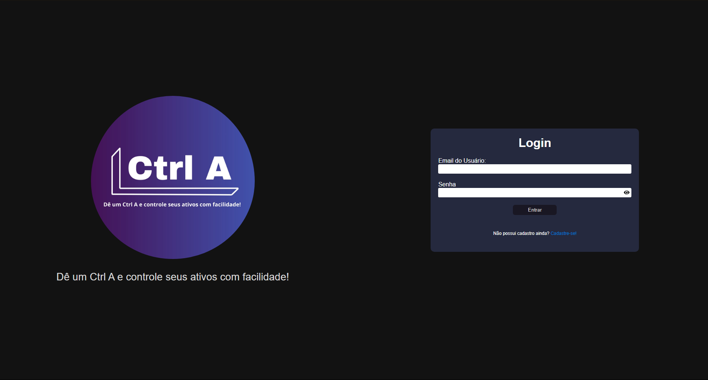
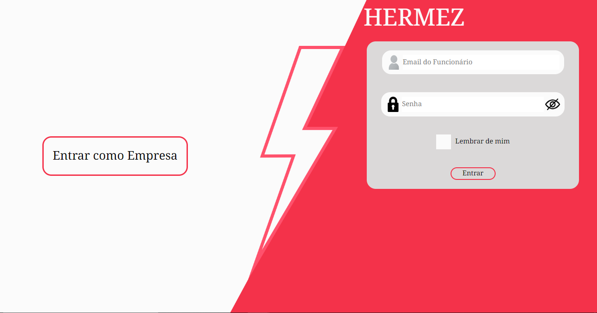
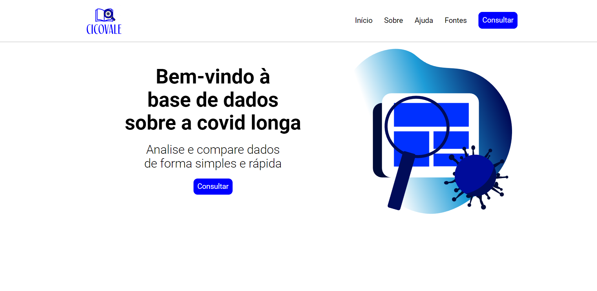

# Rafael Nunes de Farias Silva | Portfolio Pessoal

# Projetos

## Sumário
* <a href="#Ctr_A">2024 1º Sem. | Ctr_A</a>
* <a href="#Hermez">2023 2º Sem. | Hermez</a>
* <a href="#Cicovale">2023 1º Sem. | Cicovale</a>

# 2024

## 1º Sem. Ctrl_A

### Prévia da Solução

Ctrl A é um sistema de gerenciamento de ativos que disponibiliza recursos para gerenciamento de ativos tangíveis e intangíveis.

### Tecnologias Utilizadas
* Figma: Prototipagem
* Git: Versionamento
* GitHub: Armazenamento de código e documentação
* TypeScript: Linguagem de programação Front
* Java: Linguagem de programação de Back
* Jira: Organização de tarefas
* PostgreSQL | Supabase: Banco de dados
* React: Framework do Front
* Spring: Framework do Back

### Contribuições Pessoais
Atuei de forma mais distribuida nesse projeto, comecei por modelar o banco de dados e auxiliar na extruturação do front-end, fiz algumas tarefas mais simples no front, mas principalmente partes relacionadas a conexão entre as interfaces e o back-end, no back minhas maiores contribuições foram o envio e download dos anexos dos ativos (nota fiscal dos ativos e manutenções) e os calculos dos relatórios de ativo e manutenções além da geração do arquivo excel contendo todo o histórico dos ativos e os relatórios, arquivo esse que pode ser baixado pela interface no front.

### Lições Aprendidas
#### Hard Skills
* Figma: Sei fazer com autonomia
* Git: Sei fazer com autonomia
* GitHub: Sei fazer com autonomia
* TypeScript / React: Sei fazer com autonomia
* PostgreSQL: Sei fazer com autonomia
* Java / Spring: Sei fazer com autonomia

#### Soft Skills
* Organização: Parte importante do desenvolvimento foi saber organizar meus horarios para conseguir cumprir minhas tarefas no grupo.
* Comunicação: Parte de grande importância para o planejamento e andamento do projeto como um todo.

## 2023

### 2º Sem. Hermez

### Prévia da Solução

Hermez é um sistema de gerenciamento de chamados voltado para empresas no ramo da tecnologia. Na aplicação web é possível criar seu cadastro como empresa e apartir dali, cadastrar seus administradores e funcionários, os funcionários podem abrir e acompanhar seus chamados, enquanto os administradores podem gerênciar usuários e responder chamados. A ferramenta conta com chat imbutido em cada chamado que está em processo de resolução.

### Tecnologias Utilizadas
* Figma: Prototipagem
* Git: Versionamento
* GitHub: Armazenamento de código e documentação
* JavaScript: Linguagem de programação
* Jira: Organização de tarefas
* MySQL: Banco de dados
* NodeJS: Runtime
* React: Framework

### Contribuições Pessoais
Atuei principalmente no back-end desenvolvendo com JavaScript e NodeJS, fiz diversas das rotas de comunicação entre as interfaces no front e a API back-end, fazendo queries no banco de dados e tratando os dados que eram retornados para serem exibidos nas interfaces para o usuário.

### Lições Aprendidas
#### Hard Skills
* Figma: Sei fazer com autonomia
* Git: Sei fazer com autonomia
* GitHub: Sei fazer com autonomia
* JavaScript / NodeJS: Sei fazer com autonomia
* React: Sei fazer com autonomia
* MySQL: Sei fazer com autonomia

#### Soft Skills
* Organização: Parte importante do desenvolvimento foi saber organizar meus horarios para conseguir cumprir minhas tarefas no grupo.
* Comunicação: Parte de grande importância para o planejamento e andamento do projeto como um todo.

### 1º Sem. Cicovale

### Prévia da Solução
O CICOVALE (Central Informativa de COVID longa do Vale do Paraíba) é um site que possibilita ver e comparar dados sobre o impacto da COVID longa através de fontes públicas do Sistema Único de Saúde (SUS).

### Tecnologias Utilizadas
* Figma: Prototipagem
* GitHub: Versionamento e documentação
* Jira: Organização de tarefas
* Python: Parte do Back-End, como ler arquivos csv e gerar os gráficos dos mesmos, tal qual realizar a conexão entre o site e o Banco de Dados
* Flask: Utilizado como um servidor web
* HTML: Utilizado para a estruturação das páginas do site
* CSS: Utilizado para a estilização do site
* SQL: Utilizado para a criação e manutenção do banco de dados, especificamente para guardar o ranking dos filtros mais pesquisados no site

### Contribuições Pessoais
Nesse projeto fui o principal desenvolvedor back-end, fui responsável por estruturar a forma como os dados coletados do DATASUS TABNET e desenvolvi toda a parde da filtragem e geração dos gráficos com Python. Desenvolvi também a parte das URLs, que permitem o compartilhamento de filtros através da URL.

### Lições Aprendidas
#### Hard Skills
* Python: Sei fazer com autonomia;
* HTML: Sei fazer com autonomia;
* CSS: Sei fazer com autonomia;
* Flask Framework: Sei fazer com autonomia;
* BD com SQL: Sei fazer com autonomia;
* Metodologia Ágil SCRUM: Sei fazer com ajuda.

#### Soft Skills
* Organização: Parte importante do desenvolvimento foi saber organizar meus horarios para conseguir cumprir minhas tarefas no grupo.
* Comunicação: Parte de grande importância para o planejamento e andamento do projeto como um todo.

## Conteúdo
* Arquivo <a href="https://github.com/Rafael-Nunes-Silva/Portfolio-Pessoal/blob/main/src/requirements.txt">`requirements.txt`</a> com os requisitos para rodar o projeto.

### `doc/`
* Possui o <a href="https://github.com/Rafael-Nunes-Silva/Portfolio-Pessoal/blob/main/doc/Wireframe.pdf">wireframe do projeto</a> e a <a href="https://github.com/Rafael-Nunes-Silva/Portfolio-Pessoal/blob/main/doc/Color%20Palette.PNG">paleta de cores</a>

### `src/`
* Possui a pasta `static/` com as pastas `css/` e `images/`, onde estão os arquivos `.css` e de `imagem` respectivamente.
* Possui a pasta `templates/` com os arquivos `.html` do site.
* Possui o arquivo <a href="https://github.com/Rafael-Nunes-Silva/Portfolio-Pessoal/blob/main/src/app.py">`app.py`</a> que é o ponto inicial de onde o Flask rodará.

## Tecnologias utilizadas
* HTML
* CSS
* Python
* Flask
* Jinja2

## Como rodar
Para rodar o projeto abra um terminal dentro da pasta do projeto e siga as instruções abaixo:
* Inicie um ambiente virtual dentro da pasta do projeto com o comando: `python -m venv venv`.
* Entre no ambiente virtual com o comando: `.\venv\Scripts\activate`.
* Instale os requisitos dentro do ambiente virtual com o comando: `pip install -r requirements.txt`.
* Inicie o servidor web flask com o comando: `python ./src/app.py`.
* Abra o navegador de sua preferência e acesse a aplicação atraves de <a href="127.0.0.1:5000">127.0.0.1:5000</a>.
